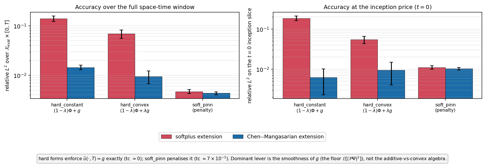
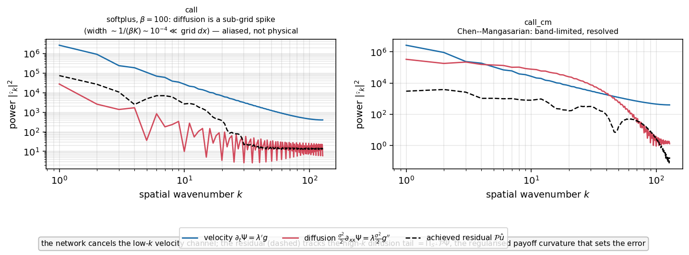

# Terminal-extension smoothing versus ansatz mode

**Date:** 2026-06-12
**Scope:** European call on the backward heat equation; two-factor comparison of
(i) the terminal-data extension $g$ and (ii) the trial-solution algebra.
**Companion note:** [`2026-06-10_forcing_floor_vs_uncancellable_residual.md`](2026-06-10_forcing_floor_vs_uncancellable_residual.md)
(theory of the $\theta$-independent forcing floor and the uncancellable residual).

---

## 1. Question

When a terminal-value PDE is solved by a constrained network, the terminal datum
is injected through a fixed **extension** $\Psi$ of the boundary data $g$, and the
network $\Phi_\theta$ supplies the interior correction. Two design choices are
usually conflated:

1. **Which extension $g$** — how the (non-smooth) payoff is smoothed before it is
   used as the terminal datum. We compare a **softplus** smoothing of the call
   payoff against a **Chen–Mangasarian** smoothing
   $M_\varepsilon(a,b)=\tfrac12\!\left(a+b+\sqrt{(a-b)^2+\varepsilon^2}\right)$.
2. **Which ansatz mode** — how $\Phi_\theta$ and $g$ are combined:
   - **additive** (`hard_constant`): $\hat u=(1-\lambda(t))\,\Phi_\theta+g$;
   - **convex combination** (`hard_convex`): $\hat u=(1-\lambda(t))\,\Phi_\theta+\lambda(t)\,g$,

   with interpolation coefficient $\lambda(T)=1$ so both enforce
   $\hat u(\cdot,T)=g$ **exactly**. The unconstrained `soft_pinn`
   (terminal datum as an $L^2$ penalty, not enforced) is shown as a reference.

The hypothesis under test, from the companion note: the achieved accuracy is
governed primarily by the $\theta$-independent **forcing floor**
$\mathbb{E}\!\left[(\mathcal{P}\Psi)^2\right]$ — a functional of $g$ alone — and
only secondarily by the additive-versus-convex algebra.

## 2. Setup

- Backward parabolic operator $\mathcal{P}=\partial_t+\mathcal{L}$ with spatial
  generator $\mathcal{L}$ — a linear elliptic operator of order $2m$. The problem
  is $\mathcal{P}u=0$ with terminal datum $u(\cdot,T)=g$, propagated to $t=0$. The
  mechanism below is stated for general $\mathcal{L}$; the runs instantiate the
  backward heat equation $\mathcal{L}=\tfrac{\sigma^2}{2}\partial_{xx}$ ($2m=2$),
  with $\sigma=0.25$ and $x=\ln S$.
- Trial solution (hard forms): $\hat u_\theta=(1-\lambda(t))\,\Phi_\theta+\Psi$
  with extension $\Psi=g$ (additive) or $\Psi=\lambda(t)\,g$ (convex), and
  $\lambda(T)=1$, so $\hat u_\theta(\cdot,T)=g$ exactly; $\Phi_\theta$ is the
  neural field supplying the interior correction.
- Identical training budget across all cells: $2\times10^4$ iterations, identical
  network width/depth, shared seeding within each cell; **3 seeds** per cell, so
  every number below is reported as mean $\pm$ std over seeds.
- Metrics: relative $L^2$ error against the closed-form solution over the
  evaluation window $\mathcal{X}_{\rm eval}\times[0,T]$; relative $L^2$ on the
  back-propagated $t=0$ inception slice (the option price); terminal mismatch
  $\mathrm{tc}=\lVert\hat u(\cdot,T)-g\rVert/\lVert g\rVert$.

## 3. Result

*Grouped-bar comparison (log axis, lower is better). Colour encodes the extension
$g$ (red = softplus, blue = Chen–Mangasarian); the $x$-axis groups the ansatz
mode. Error bars are std over 3 seeds. Left: accuracy over the full space-time
window. Right: accuracy at the $t=0$ inception price.*

Mean $\pm$ std over 3 seeds (linear interpolation coefficient $\lambda(t)=t/T$):

| extension $g$ | mode | $\dfrac{\lVert\hat u-u^\star\rVert_{\mathcal{X}_{\rm eval}\times[0,T]}}{\lVert u^\star\rVert}$ | $\dfrac{\lVert\hat u-u^\star\rVert_{t=0}}{\lVert u^\star\rVert}$ | $\mathrm{tc}=\dfrac{\lVert\hat u(\cdot,T)-g\rVert}{\lVert g\rVert}$ |
|---|---|---|---|---|
| softplus | `hard_constant` | $1.39\times10^{-1}\pm2\times10^{-2}$ | $1.85\times10^{-1}\pm2\times10^{-2}$ | $0$ (exact) |
| softplus | `hard_convex` | $6.94\times10^{-2}\pm1\times10^{-2}$ | $5.42\times10^{-2}\pm1\times10^{-2}$ | $0$ (exact) |
| softplus | `soft_pinn` | $4.69\times10^{-3}\pm4\times10^{-4}$ | $1.11\times10^{-2}\pm1\times10^{-3}$ | $7.0\times10^{-3}$ |
| Chen–Mangasarian | `hard_constant` | $1.44\times10^{-2}\pm2\times10^{-3}$ | $6.22\times10^{-3}\pm4\times10^{-3}$ | $0$ (exact) |
| Chen–Mangasarian | `hard_convex` | $9.47\times10^{-3}\pm3\times10^{-3}$ | $9.52\times10^{-3}\pm5\times10^{-3}$ | $0$ (exact) |
| Chen–Mangasarian | `soft_pinn` | $4.34\times10^{-3}\pm3\times10^{-4}$ | $1.03\times10^{-2}\pm8\times10^{-4}$ | $7.1\times10^{-3}$ |

(The exponential interpolation coefficient $\lambda(t)=e^{-\gamma(T-t)}$ is in the
saved table `terminal_extension_vs_mode.yaml`; it is statistically
indistinguishable from the linear one — no consistent winner.)

### 3.1 Loss-component decomposition

The training objective for the hard forms is the PDE residual
$L_{\rm pde}=\lVert\mathcal{P}\hat u_\theta\rVert^2=\lVert R_\theta+f\rVert^2$,
which the logger records split into the three additive terms of the companion
note (§2.1–2.2),

$$
L_{\rm pde}
=\underbrace{\lVert R_\theta\rVert^2}_{\text{network energy}}
+\underbrace{2\langle R_\theta,f\rangle}_{\text{cross}}
+\underbrace{\lVert f\rVert^2}_{\text{floor}},
\qquad f=\mathcal{P}\Psi,
$$

and the floor itself resolved into the two forcing channels of §3 of that note —
with $\Psi=\lambda(t)\,g$ and $\mathcal{P}=\partial_t+\mathcal{L}$,

$$
f=\mathcal{P}\Psi
=\underbrace{\lambda'(t)\,g}_{\text{velocity}}
+\underbrace{\lambda(t)\,\mathcal{L}g}_{\text{operator}}
\qquad(\text{velocity}\equiv0\ \text{for the additive form, where }\Psi=g).
$$

In the heat instance $\mathcal{L}g=\tfrac{\sigma^2}{2}g''$, so the operator
channel is the diffusion forcing $\lVert\lambda\tfrac{\sigma^2}{2}g''\rVert^2$
(logged as `forcing_diffusion`).

Measured values (mean $\pm$ std over 3 seeds, averaged over the final 10 % of
iterations; these are single-minibatch estimates of the collocation expectation,
hence the wide spread on the floor):

| extension $g$ | mode | floor $\lVert f\rVert^2$ | velocity $\lVert\lambda'g\rVert^2$ | operator $\lVert\lambda\mathcal{L}g\rVert^2$ | net. energy $\lVert R_\theta\rVert^2$ | cross $2\langle R_\theta,f\rangle$ | $L_{\rm pde}=\lVert R_\theta+f\rVert^2$ |
|---|---|---|---|---|---|---|---|
| softplus | additive | $7200\pm1200$ | $0$ | $7200\pm1200$ | $2330\pm260$ | $-4390\pm1100$ | $5160\pm1500$ |
| softplus | convex | $3830\pm1100$ | $841\pm7$ | $2920\pm1100$ | $1320\pm50$ | $-2760\pm290$ | $2390\pm1100$ |
| Chen–Mangasarian | additive | $80\pm26$ | $1.7$ | $91\pm27$ | $42\pm22$ | $-82\pm42$ | $39\pm45$ |
| Chen–Mangasarian | convex | $974\pm30$ | $841\pm7$ | $65\pm26$ | $948\pm3$ | $-1897\pm6$ | $25\pm25$ |

(The floor exceeds velocity $+$ operator by the velocity–operator cross term
$2\langle\lambda'g,\lambda\mathcal{L}g\rangle$; the additive identity
$L_{\rm pde}=\lVert R_\theta\rVert^2+2\langle R_\theta,f\rangle+\lVert f\rVert^2$
holds to logging precision in every row.)

Three readings, each a measured instance of the companion-note theory.

1. **Smoothing collapses the operator channel.** Replacing softplus by
   Chen–Mangasarian reduces the operator forcing $\lVert\lambda\,\mathcal{L}g\rVert^2$
   by a factor $\approx79$ for the additive form ($7200\to91$) and $\approx45$
   for the convex form ($2920\to65$). An order-$2m$ elliptic $\mathcal{L}$
   amplifies a Fourier mode of wavenumber $k$ by $\sim|k|^{2m}$, so $\mathcal{L}g$
   concentrates at the high frequencies of $g$ — the regularised payoff kink (in
   the heat instance $\mathcal{L}g=\tfrac{\sigma^2}{2}g''$, the at-the-money
   terminal curvature). This channel is the high-frequency, largely uncancellable
   part of the forcing; its collapse is the quantitative origin of the
   $\approx10\times$ accuracy gain of §4(i).
2. **The velocity channel is smoothing-invariant.** $\lVert\lambda'g\rVert^2=841$
   for both extensions ($\pm7$), because it carries the profile of the datum $g$
   itself, whose magnitude $\lVert g\rVert\sim K$ is fixed by the payoff and
   barely changed by smoothing — the smoothing acts on the curvature near the
   strike, not on $\lVert g\rVert$. This channel is low-frequency and, by item 3,
   cancellable.
3. **The achieved residual is not the floor.** The convex Chen–Mangasarian cell
   has a floor of $974$, twelve times the additive cell's $80$, yet a *smaller*
   PDE loss ($25$ vs $39$). The optimiser synthesises and subtracts almost the
   entire velocity channel: its network energy $948\approx$ floor and cross
   $-1897\approx-2\times$ floor, i.e. $R_\theta\approx-f$ on the cancellable
   subspace, leaving only the uncancellable high-frequency operator-channel
   remainder. This is the floor-versus-uncancellable inversion of the companion note,
   measured directly: a larger floor made of cancellable velocity coexists with a
   smaller achievable error.

### 3.2 Spectral decomposition of the residual

The §3.1 attribution — velocity is *low-frequency and cancellable*, the operator
channel is *high-frequency and uncancellable* — is a claim about where in
wavenumber each quantity lives. We test it directly by taking the spatial power
spectrum of each field. For a trained hard-form run we evaluate, on a uniform
grid over $\mathcal{X}_{\rm eval}$ at several time slices, the two forcing
channels — the velocity $\partial_t\Psi=\lambda'(t)\,g$ and the operator channel
$\lambda(t)\,\mathcal{L}g$ (heat instance $\lambda\tfrac{\sigma^2}{2}g''$) — and
the achieved residual $\mathcal{P}\hat u=\partial_t\hat u+\mathcal{L}\hat u$, take
the real FFT $|\widehat{\cdot}_k|^2$, and average over slices (convex form,
$\lambda(t)=t/T$).

*Spatial power spectra (log–log, common scale across panels): velocity channel
$\partial_t\Psi=\lambda'(t)g$ (blue), operator channel $\lambda(t)\mathcal{L}g$
(red; heat instance $\lambda\tfrac{\sigma^2}{2}g''$), achieved residual
$\mathcal{P}\hat u=\partial_t\hat u+\mathcal{L}\hat u$ (dashed). Left: softplus
extension. Right: Chen–Mangasarian extension.*

**Resolved case (Chen–Mangasarian, right panel) — the attribution holds as
stated.** The velocity channel dominates at low $k$ and the operator channel
(here the diffusion forcing) at high $k$, crossing over near $k\approx5$. The
achieved residual sits about three orders of magnitude *below* both at low $k$ —
the network synthesises and subtracts the low-$k$ velocity channel, exactly the
$R_\theta\approx-f$ cancellation measured in §3.1(3) — and **rises to track the
operator-channel tail** at high $k$. The dashed residual coinciding with the red
operator-channel curve for $k\gtrsim40$ is the
uncancellable remainder $\Pi_{\mathcal{S}^\perp}\mathcal{P}\Psi$ made visible: the
regularised payoff curvature is what survives and sets the error.

**Softplus case (left panel) — a measurement caveat that is itself the
mechanism.** Here the operator channel (red) is jagged and suppressed: this is
aliasing, not a band-limited spectrum. With $\beta=100$ the softplus second
derivative is a near-singular spike of width $\sim 1/(\beta K)\sim10^{-4}$ in
$x$, far below the grid spacing $dx\approx3\times10^{-3}$, so a uniform FFT cannot
represent it and folds its energy into broadband noise. The red curve there must
**not** be read as a spectrum. Physically this is the extreme of the same
mechanism: the softplus extension places its curvature in content beyond any
practical grid Nyquist — maximally high-frequency and therefore maximally
uncancellable — which is precisely why it is the worst extension (the §3.1 floor
$7200$ for additive softplus is the spatially-sampled shadow of this spike, with
the large seed spread of §3.1 reflecting how rarely the collocation grid lands on
it). Resolving the spike faithfully would require $N_x\gtrsim 3\times10^4$; the
quantitative channel energies of §3.1, sampled in training, are the reliable
measure, and the spectrum is shown to expose the resolution limit honestly rather
than to quote a number from it.

Reproduce:
`experiments/python_scripts/exp_ansatz_forms_heat/spectral_gap_analysis.py`
(figure `forcing_channels_spectra.png`).

## 4. Reading

**(i) The extension $g$ is the dominant lever.** Holding the mode fixed, replacing
the softplus extension by the Chen–Mangasarian one reduces the space-time error
by a factor of **9.7** for `hard_constant` ($1.39\times10^{-1}\to1.44\times10^{-2}$)
and **7.3** for `hard_convex`; at the inception slice the factor reaches **30**
for `hard_constant`. This is the quantitative signature predicted by the floor
theory: the softplus extension has a sharply peaked $\mathcal{L}g$ near the strike
(in the heat instance the curvature $\tfrac{\sigma^2}{2}g''$), hence a large
operator forcing and a large floor $\mathbb{E}[(\mathcal{P}\Psi)^2]$; the surviving
high-frequency part $\Pi_{\mathcal{S}^\perp}\mathcal{P}\Psi$ that the network cannot
cancel is correspondingly large. The Chen–Mangasarian smoothing controls
$\mathcal{L}g$ directly — it bounds the high-order derivatives of $g$ — and shrinks
the floor.

**(ii) The additive-versus-convex algebra is a secondary lever.** Holding $g$
fixed, switching from `hard_constant` to `hard_convex` improves the space-time
error by a factor of **2.0** on the rough softplus extension but only **1.5** on
the smooth Chen–Mangasarian one — and at the inception slice the two modes are
within noise for the smooth extension (the convex form is even marginally worse:
$6.22\times10^{-3}$ vs $9.52\times10^{-3}$, well inside one std).

Mechanistically, the two modes forge the forcing $f=\mathcal{P}\Psi$ differently
(channel decomposition measured in §3.1). The additive form uses the
time-independent extension $\Psi=g$, so $f=\mathcal{L}g$ is a pure operator spike
with **no** velocity channel. The convex form uses $\Psi=\lambda(t)\,g$, which
simultaneously (a) **adds** a velocity channel $\lambda'(t)\,g$ and (b) **scales**
the operator spike $\mathcal{L}g$ by $\lambda(t)\le1$. The two effects move the
floor in opposite directions but the *error* in only one:

- The operator spike is damped by the time-average $\langle\lambda^2\rangle$;
  for the linear schedule $\lambda(t)=t/T$ this is $\int_0^1 s^2\,ds=\tfrac13$,
  and the measured operator channel indeed falls by $\approx2$–$3\times$
  ($7200\to2920$ on softplus, $91\to65$ on Chen–Mangasarian, §3.1). Because
  $\lambda(t)\to0$ as $t\to0$, the damping is strongest at early time — exactly
  the back-propagated region where the inception price is read.
- The added velocity channel $\lambda'g$ **inflates the floor** (by $\approx840$,
  §3.1 item 2) but lies in the network-reachable subspace, so the optimiser
  cancels it (§3.1 item 3) and it does **not** raise the error.

The net effect on the error is therefore set by the damping of the operator
spike alone. On the rough softplus extension that spike is the binding,
uncancellable term, so damping it by $\langle\lambda^2\rangle\approx\tfrac13$
yields the measured $\approx2\times$ improvement. On the smooth Chen–Mangasarian
extension the operator spike is already two orders of magnitude smaller (§3.1),
so damping it further changes little while the added cancellable velocity channel
inflates the floor $12\times$ — hence the convex mode's net gain falls within
seed noise. In short, the mode matters precisely when the operator forcing
$\mathcal{L}g$ is the binding term, i.e. when $g$ is rough; once $g$ is smooth the
floor is dominated by the cancellable velocity channel and the algebra barely
moves the error.

**(iii) Hard enforcement with a good extension matches — and at inception beats —
the unconstrained PINN.** The `soft_pinn` reference is the most accurate in the
interior, but it does **not** enforce the terminal datum: $\mathrm{tc}\approx
7\times10^{-3}$. With the smooth Chen–Mangasarian extension the hard forms close
most of that gap (space-time error within a factor $\sim2$ of `soft_pinn`) while
enforcing $\hat u(\cdot,T)=g$ to machine precision. **At the $t=0$ inception price
— the quantity of practical interest — the exactly-constrained `hard_constant`
Chen–Mangasarian form ($6.2\times10^{-3}$) is more accurate than `soft_pinn`
($1.0\times10^{-2}$).** Exact terminal enforcement plus a low-floor extension is
therefore the best accuracy/constraint trade-off here.

## 5. Greek shapes and the at-the-money singularity

**The genuine singularity is the at-the-money terminal $\Gamma$.** For the true
call payoff $V(\cdot,T)=(S-K)^+$ the second derivative
$\Gamma=\partial_{SS}V=\delta(S-K)$ is a Dirac mass at the strike; smoothing
regularises it to a finite bump of height $O(1/\varepsilon)$. This terminal
curvature enters the forcing through the operator channel $\mathcal{L}g$ of §3.1 —
in the heat instance $\mathcal{L}g=\tfrac{\sigma^2}{2}g''$, the regularised
terminal $\Gamma$ up to the $x=\ln S$ Jacobian — so the floor's operator part is
its squared $L^2$ norm. The measured $\approx79\times$
difference in that channel between softplus and Chen–Mangasarian (§3.1, item 1)
is therefore a direct measurement of the relative height of the at-the-money
$\Gamma$ spike of the two extensions. A coarse evaluation grid cannot see this:
finite-differencing the saved 300-point terminal slice returns
$\max|g''|\approx6.5\times10^3$ for *both* extensions — the grid undersamples the
spike, whereas the autograd-computed floor resolves the $\approx79\times$ gap.
The spike is a near-singularity that only a derivative-aware (autograd) residual
measures faithfully.

**Backward propagation mollifies the spike.** The solution operator
$e^{(T-t)\mathcal{L}}$ damps the eigen-mode of $\mathcal{L}$ with eigenvalue
$-\Lambda_k$ by $e^{-\Lambda_k(T-t)}$, with $\Lambda_k\sim|k|^{2m}$ for an
order-$2m$ elliptic generator (heat instance: $\Lambda_k=\tfrac{\sigma^2}{2}k^2$).
So by $t=0$ the terminal $\Gamma$ spike is smoothed into an $O(1)$ bump and no
singularity survives in the interior. This is why the inception-price error
($10^{-2}$–$10^{-3}$, §3) is far below what the raw terminal curvature
(floor $\sim10^3$) would suggest: the uncancellable high-frequency content is
exponentially damped over the propagation interval $[0,T]$.

**Recorded greeks (companion Bermudan-put ablation).** Greeks were not logged for
the European-call runs of this report; the related Bermudan-put runs (single seed,
2026-06-11) carry $\Delta=e^{-x}\partial_x u$ and $\Gamma$ computed by autograd
through the trained field. Within the evaluation window $S\in[60,140]$ they show:

- $\Gamma$ is the **harder** greek — its relative $L^2$ error is $\approx3\times$
  that of $\Delta$ for every form (additive $2.5\times10^{-2}$ vs
  $8.0\times10^{-3}$; convex $1.4\times10^{-2}$ vs $2.4\times10^{-3}$; `soft_pinn`
  $1.0\times10^{-3}$ vs $1.0\times10^{-4}$), as expected since each spatial
  derivative amplifies the network's residual high-frequency error by $|k|$.
- The in-window $\Gamma$ error **peaks at the strike** $S=K=100$, where the
  propagated $\Gamma$ bump (maximum near $S\approx90$) is steepest — the
  at-the-money region is the hardest. The deep-in-the-money negative-$\Gamma$
  excursion visible at $S\approx20$–$25$ lies **outside** the evaluation window
  and is a boundary-extrapolation artefact, not part of the reported metric.
- The form ordering on greeks, `soft_pinn` $<$ convex $<$ additive, **matches the
  price-error ordering**, so the extension and mode levers act on the greeks as
  they do on the price.

These observations are single-seed and from a different instrument; they are
corroborative, not a controlled measurement on the European call.

## 6. Consequence for the Bermudan / American backward induction

Backward induction over exercise dates **propagates** the per-stage terminal error
stage-to-stage: the trained solution at one exercise date becomes the terminal
datum of the previous stage. The two findings above translate into a concrete
prescription:

- Smooth each stage-terminal datum with **Chen–Mangasarian**, not softplus — this
  is where the order-of-magnitude accuracy lives, and it is the cheapest lever.
- Use a **hard** form so the stage-terminal condition is enforced exactly (no
  $7\times10^{-3}$ terminal leak that would compound across stages); the
  additive-versus-convex choice is second order and can be fixed to `hard_convex`
  for the modest benefit on any residual roughness.

## 7. Claim strength and scope

- All numbers are **empirical**, $n=3$ seeds, single architecture and training
  budget, one strike/maturity. The factor estimates ($\approx10$ for the
  extension, $\approx2$ for the mode) are stable across seeds but not yet across a
  hyperparameter sweep.
- The floor → error link is the **conjectured** mechanism of the companion note;
  it is corroborated here by the monotone extension-smoothness effect but is not a
  proof. The across-IC stability constant is problem-dependent (see the spectral
  analysis, which did *not* collapse cleanly across initial conditions).
- Greeks ($\Delta,\Gamma$) were **not** recorded for the European-call runs of
  this report; the greek discussion of §5 draws on the related Bermudan-put runs
  (single seed) and is corroborative only. It confirms that $\Gamma$ is the
  hardest quantity (relative error $\approx3\times$ that of $\Delta$, peaking at
  the money) but is not a controlled, multi-seed measurement on the call.

**Reproduce:**
`experiments/python_scripts/exp_ansatz_forms_heat/terminal_extension_vs_mode_comparison.py`
(torch-free; reads the saved `summary.yaml` of the `call` / `call_cm` ablation
runs, no retraining).
