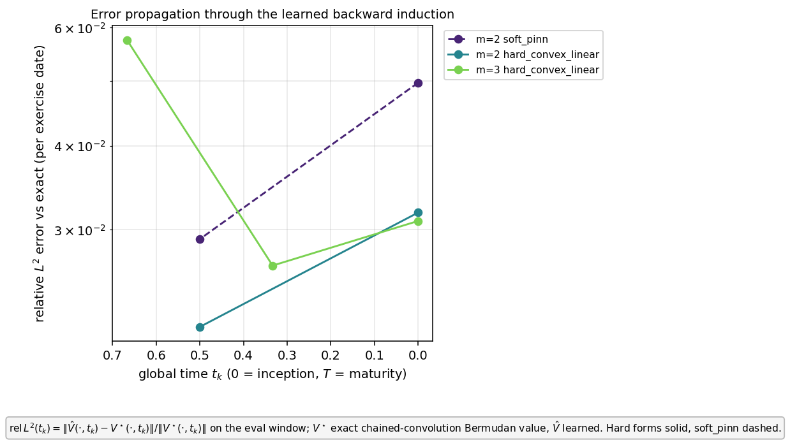
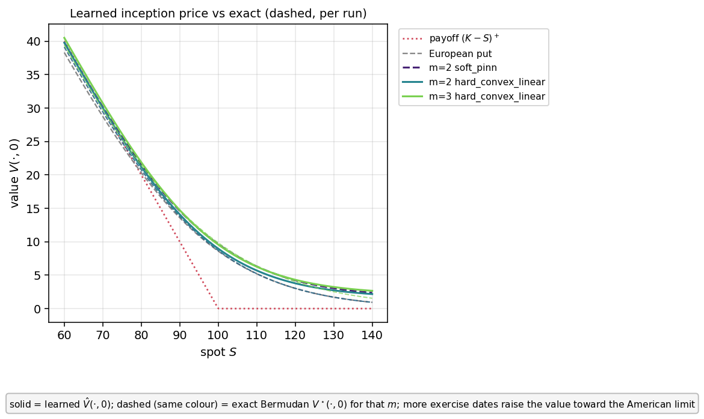

# Validating the learned backward induction for a Bermudan option

**Date:** 2026-06-13
**Scope:** does solving each step of a Bermudan-option backward induction with a
neural network — instead of an exact formula — reproduce the true price, and how
does the per-step error accumulate as the number of exercise dates grows?

---

## 1. The quantity we want to compute

A **Bermudan put** is the right to sell one unit of an asset at a fixed strike
price $K$, exercisable only at a finite set of dates
$t_1 < t_2 < \dots < t_m = T$ (the last one is maturity $T$). Write $S$ for the
asset price and $V(t,S)$ for the option's value at time $t$ and price $S$. We work
in the log-price $x = \ln S$ and write $u(t,x)=V(t,e^x)$.

Between two exercise dates the holder does nothing, and the value satisfies the
**backward heat equation**

$$\partial_t u + \tfrac{\sigma^2}{2}\,\partial_{xx} u = 0,$$

where $\sigma$ is the volatility (here $\sigma=0.25$). "Backward" means the value
is known at the later time and propagated to the earlier time.

At each exercise date $t_j$ the holder chooses the larger of two quantities:
exercise now, worth the **payoff** $(K-S)^+=\max(K-S,0)$, or keep the option,
worth the **continuation value** $C(t_j,\cdot)$. This gives the exact recursion
(the dynamic program), from maturity down to today:

$$
V(t_m,S)=(K-S)^+,\qquad
C(t_j,\cdot)=\text{(heat propagation of }V(t_{j+1},\cdot)\text{ from }t_{j+1}\text{ to }t_j),
$$
$$
V(t_j,S)=\max\!\bigl((K-S)^+,\,C(t_j,S)\bigr).
$$

The number reported to a trader is the **inception price** $V(0,S_0)$ at today's
time $t=0$.

## 2. The exact reference (the "ground truth")

Propagating a value backward over a time gap $\Delta\tau$ under the heat equation
is exactly a **Gaussian convolution** (averaging with a normal kernel of variance
$\sigma^2\Delta\tau$). So the recursion above can be computed to machine accuracy
with no neural network at all: chain one Gaussian convolution per inter-date
interval and take the $\max$ with the payoff at each date. We call this exact
value $V^\star$. It is implemented in `bermudan_put_value_exact` and is the
reference against which everything below is measured. (Its only approximation is a
fine numerical quadrature for the convolution; this is what makes the *exact*
reference the slow part at large $m$ — it is a chain of $m$ nested convolutions.)

## 3. What the network does instead

We replace the exact propagation on each interval by a trained neural network.
On the interval $[t_j,t_{j+1}]$ we write the candidate value as a **trial
solution**

$$\hat u_\theta(x,t)=\bigl(1-\lambda(t)\bigr)\,\Phi_\theta(x,t)+\lambda(t)\,g(x),$$

where $\Phi_\theta$ is a neural network with weights $\theta$, $g$ is the value
imposed at the top of the interval (the terminal datum), and $\lambda$ is a scalar
"weight" function with $\lambda(t_{j+1})=1$. Because $\lambda=1$ at the top, the
trial solution **equals $g$ exactly** at $t_{j+1}$, whatever the network does.
The weights $\theta$ are chosen to make the equation residual small:

$$\theta^\star=\arg\min_\theta\ \Big\|\ \partial_t\hat u_\theta
+\tfrac{\sigma^2}{2}\partial_{xx}\hat u_\theta\ \Big\|^2,$$

the norm being an average of the squared left-hand side over many randomly sampled
points $(x,t)$ in the interval.

**Backward induction with learned steps.** We solve the intervals from maturity
downward. The top interval uses the (smoothed) payoff as its terminal datum
$g$. Each lower interval uses, as its terminal datum, the smoothed maximum of the
payoff and the **learned** continuation value coming from the interval above —
that is, every step is learned; no analytic value is ever injected. "Smoothed"
means the kink of $\max(a,b)$ is rounded by
$M_\varepsilon(a,b)=\tfrac12\!\left(a+b+\sqrt{(a-b)^2+\varepsilon^2}\right)$
($\varepsilon=2$), which removes a corner the network cannot represent.

**Two ways to impose the terminal datum, compared.**
- `hard_convex`: the trial solution above, which matches $g$ *exactly* at the top
  of each interval.
- `soft_pinn`: the plain network $\hat u_\theta=\Phi_\theta$ with the terminal
  datum added only as a **penalty** in the objective, so it is matched only
  approximately. This is a baseline to show what the exact matching buys.

## 4. The experiments actually run

All runs: strike $K=100$, volatility $\sigma=0.25$, maturity $T=1$, equally spaced
exercise dates $t_j=jT/m$, $2\times10^4$ optimiser iterations per interval, one
random seed, one V100 GPU. Accuracy is the **relative $L^2$ error** against the
exact reference on the price window $S\in[60,140]$,

$$
\mathrm{rel}\,L^2(t)=\frac{\bigl\|\hat V(t,\cdot)-V^\star(t,\cdot)\bigr\|}
{\bigl\|V^\star(t,\cdot)\bigr\|},
$$

i.e. the size of the mismatch divided by the size of the true value (so $0.03$
means a 3 % error).

| run | exercise dates | terminal handling | what it tests |
|---|---|---|---|
| m=2 `hard_convex` | $\{0.5,\,1\}$ | exact | two learned steps |
| m=2 `soft_pinn` | $\{0.5,\,1\}$ | penalty only | cost of inexact terminal |
| m=3 `hard_convex` | $\{1/3,\,2/3,\,1\}$ | exact | three learned steps |
| m=10 `hard_convex` | $\{0.1,\dots,1\}$ | exact | ten steps (running) |

## 5. The figures

### Figure 1 — how the error grows down the induction

Each marker is one exercise date of one run. The horizontal axis is the global
time $t_k$ of that date, **drawn with maturity on the left and inception ($t=0$)
on the right**, because the induction is computed in that order (maturity first).
The vertical axis (log scale) is the relative $L^2$ error at that date, defined
above. Solid lines are the `hard_convex` runs; the dashed line is the `soft_pinn`
baseline.

Reading it:
- **`soft_pinn` (dashed)** starts at $2.9\%$ near maturity and *rises* to $5.0\%$
  at inception: the small terminal mismatch left at each step is carried into the
  next step and accumulates.
- **`hard_convex`, m=2 (solid)** is lower throughout, $2.15\%\to3.18\%$: exact
  terminal matching removes that accumulating mismatch.
- **`hard_convex`, m=3 (solid)** is *not monotone*: $5.75\%$ at the first date
  solved ($t=2/3$), then $2.65\%$ at $t=1/3$, then $3.09\%$ at inception. The
  largest error is at the top step, not at inception.

### Figure 2 — the learned price against the exact price

Horizontal axis: asset price $S$. Vertical axis: option value at today's time,
$V(0,S)$. **Solid** curves are the learned values $\hat V(0,\cdot)$; the
**dashed curve of the same colour** is the exact value $V^\star(0,\cdot)$ for that
same run. The dotted red curve is the immediate-exercise payoff $(K-S)^+$; the
grey dashed curve is the European put (exercisable only at maturity).

Reading it:
- For every run the solid (learned) and dashed (exact) curves lie on top of each
  other — the learned induction reproduces the true price across the window.
- Every learned curve sits **above** the European put: the right to exercise early
  is worth a positive amount (the early-exercise premium).
- The m=3 curve sits slightly **above** the m=2 curve: more exercise opportunities
  can only increase the value, approaching the American (continuous-exercise) limit.

## 6. What we conclude (and how strongly)

1. **The procedure is correct end to end.** With every step learned, the chained
   induction reproduces the exact Bermudan price to about $3\%$ for $m=2$ and
   $m=3$ (Figure 2). This is a *measured* result on one seed.
2. **Exact terminal matching beats a penalty.** At inception the `hard_convex`
   error is $3.18\%$ versus $5.0\%$ for `soft_pinn` (Figure 1). The penalty form
   leaves a terminal mismatch at each step that compounds; the exact form does
   not. *Measured*, one seed.
3. **The error does not simply pile up toward inception.** Because backward
   propagation is a Gaussian average (a smoothing operation), it *damps* the error
   inherited from the step above. The error at each date is therefore a balance
   between the error a step adds and the smoothing of the error it inherits, which
   is why the $m=3$ curve is highest at the top step and lower below it
   (Figure 1). *Observed*; a clean separation of the two effects is not yet done.
4. **Adding steps did not blow the error up.** $m=2$ and $m=3$ reach almost the
   same inception error ($3.18\%$ vs $3.09\%$). The $m=10$ run tests whether this
   stability holds with nine intermediate dates.

## 7. Limits of these results

- **One seed, one setting.** Single network size, single optimiser budget, one
  $(K,\sigma,T)$, equally spaced dates. The $\approx3\%$ floor is set mainly by
  the top step, which must learn the sharp (smoothed) payoff; the spectral
  analysis of the companion call study shows such a sharp terminal datum leaves a
  high-frequency residual the network cannot remove. A variance estimate needs
  several seeds.
- **`soft_pinn` is a baseline, not a competitor**, since it does not enforce the
  terminal datum; its larger error is expected and is the point of the comparison.

**Reproduce.**
Training: `experiments/python_scripts/exp_ansatz_forms_heat/bermudan_backward_induction.py`
(`--m`, `--variant`, `--num-iterations`).
Figures: `experiments/python_scripts/exp_ansatz_forms_heat/bermudan_induction_comparison.py`
(torch-free; reads the saved `validation.npz` of each run).
