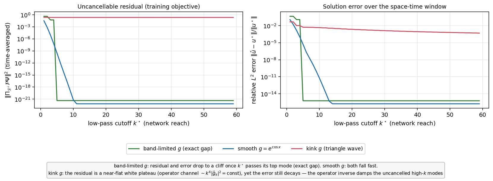
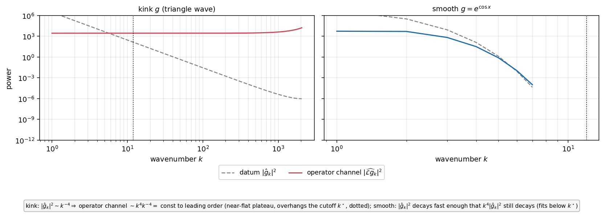
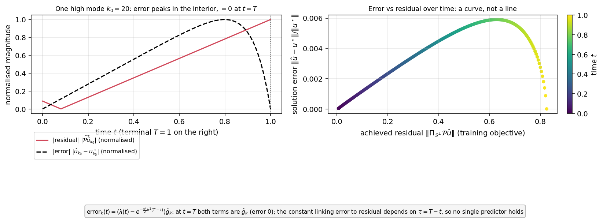

# A solvable toy for the operator-channel mechanism

**Date:** 2026-07-03
**Scope:** an analytic, fully solvable companion to the empirical spectral analysis
of [2026-06-12_terminal_extension_smoothing_vs_ansatz_mode.md](2026-06-12_terminal_extension_smoothing_vs_ansatz_mode.md)
(§3.2). It isolates, in closed form, why the achieved error is controlled by the
high-frequency part of the operator channel $\mathcal{L}g$, and why the residual
that training minimises is not the same as the solution error.

---

## 1. The idea

The empirical study established that, for a hard-constrained network solving a
terminal-value PDE, the leftover residual is the part of the forcing
$\mathcal{P}\Psi$ that the network cannot represent — its high wavenumbers — and
that this is dominated by the **operator channel** $\mathcal{L}g$. To see the
mechanism with no confounds (no training, no architecture, no optimiser), the toy
replaces the network by its **idealised spectral behaviour**: an ideal low-pass
filter. Every quantity is then closed form, one Fourier mode at a time.

## 2. Setup

On the circle $x\in[0,2\pi)$ (periodic, so Fourier modes $e^{ikx}$ diagonalise the
operators), with spatial operator $\mathcal{L}=\tfrac{\sigma^2}{2}\partial_{xx}$
($\sigma=0.25$, $T=1$):

$$\mathcal{P}u=\partial_t u+\mathcal{L}u=0,\qquad u(\cdot,T)=g=\sum_k\hat g_k\,e^{ikx}.$$

The exact solution decays mode-wise in $\tau=T-t$:
$u^\star_k(t)=\hat g_k\,e^{-\frac{\sigma^2}{2}k^2(T-t)}$.

The hard-constrained trial solution is $\hat u=(1-\lambda(t))\Phi+\lambda(t)g$ with
$\lambda(t)=t/T$ (so $\lambda(T)=1$ and $\hat u(\cdot,T)=g$ exactly). The network
$\Phi$ is modelled as an **ideal low-pass filter of cutoff $k^\star$**: it can
represent — and therefore cancel — any spatial content with $|k|\le k^\star$, and
nothing above. This is the clean idealisation of spectral bias (the real network's
frequency response is soft, not a hard cutoff; see §6).

Solving mode by mode (derived below, checked numerically to $10^{-10}$ in the
script):

- **$|k|\le k^\star$:** the filter reproduces the exact mode, $\hat u_k=u^\star_k$,
  **residual $=0$**.
- **$|k|>k^\star$** ($\Phi_k=0$): $\hat u_k(t)=\lambda(t)\hat g_k$, and

$$
\text{residual}_k(t)=\Bigl(\underbrace{\lambda'(t)}_{\text{velocity}}
   -\underbrace{\tfrac{\sigma^2}{2}k^2\lambda(t)}_{\text{operator channel}}\Bigr)\hat g_k,
\qquad
\text{error}_k(t)=\bigl(\lambda(t)-e^{-\frac{\sigma^2}{2}k^2(T-t)}\bigr)\hat g_k.
$$

Three terminal data with controlled spectra are compared: **band-limited** (a few
low modes; an exact spectral gap), **smooth** ($g=e^{\cos x}$, analytic, spectrum
decays super-exponentially), and **kink** (a triangle wave, $|\hat g_k|^2\sim
k^{-4}$ — the regularised-payoff analogue).

## 3. The figures

### Figure 1 — performance is set by the forcing mass above the cutoff

Both panels sweep the filter cutoff $k^\star$ (network reach) on the horizontal
axis. **Left:** the time-averaged uncancellable residual energy
$\lVert\Pi_{\mathcal{S}^\perp}\mathcal{P}\Psi\rVert^2$ (log scale). **Right:** the
relative $L^2$ solution error over the space-time window.

- **Band-limited $g$ (green):** both the residual and the error drop to a cliff —
  to machine zero — as soon as $k^\star$ passes the datum's top mode ($k=5$). An
  exact spectral gap gives an exact solution.
- **Smooth $g$ (blue):** both fall exponentially, reaching machine zero by
  $k^\star\approx13$ (the datum has essentially no content above that).
- **Kink $g$ (red):** the residual (left) is a **near-flat plateau** — raising
  $k^\star$ from $1$ to $59$ lowers it by only ~2 % — because the operator channel
  is white (Figure 2). Yet the solution error (right) still **decays** (by a factor
  ~50 over the same range). The residual and the error part company: the residual
  cannot be reduced by more network reach, but the error can, because the operator
  inverse (heat propagation) damps the uncancelled high-$k$ modes (Figure 3).

### Figure 2 — the $k^4$ amplification

At fixed cutoff (dotted line), for the kink (left) and smooth (right) data: the
datum spectrum $|\hat g_k|^2$ (grey dashed) and the operator-channel spectrum
$|\widehat{\mathcal{L}g}_k|^2=(\tfrac{\sigma^2}{2}k^2)^2|\hat g_k|^2$ (solid). The
operator multiplies each mode by its symbol $-\tfrac{\sigma^2}{2}k^2$, i.e. it
amplifies power by $k^4$.

- **Kink:** $|\hat g_k|^2\sim k^{-4}$, so the operator channel is $\sim
  k^4\!\cdot\!k^{-4}=$ const to leading order — a near-flat white plateau that
  overhangs the cutoff. (It tilts up ~50 % near the grid's Nyquist wavenumber,
  where the discrete triangle-wave coefficients leave the exact $k^{-2}$ envelope;
  the plateau is the leading-order statement.)
- **Smooth:** $|\hat g_k|^2$ decays fast enough that even after the $k^4$ boost the
  operator channel still decays and stays below the cutoff — nothing to leave
  uncancelled.

### Figure 3 — residual is not error; the link is the operator inverse

**Left:** for one mode above the cutoff ($k_0=20$, kink datum), the magnitudes of
the residual and the solution error over time, each normalised to its own maximum.
The residual dips to zero at $t\approx1/(\tfrac{\sigma^2}{2}k_0^2)$ (a sign change,
where velocity balances the operator channel) then grows toward maturity; the
error rises from zero, **peaks in the interior** ($t\approx0.8$), and returns to
**exactly zero at $t=T$** (the hard constraint). They have different time
profiles.

**Right:** the aggregate error plotted against the aggregate residual, traced over
time (colour $=t$). It is a **curve, not a line**: the residual is monotone in $t$
while the error is not, so one residual value corresponds to two errors. The factor
linking error to residual is the propagation damping $e^{-\frac{\sigma^2}{2}k^2\tau}$,
which depends on $\tau=T-t$ (and on the operator). This is the closed-form reason
the empirical error predictor did not collapse across problems: the residual is
what training sees, but the map from residual to error is the problem-dependent
operator inverse.

## 4. What each figure proves

1. **Spectral gap ⇒ perfect (Figure 1).** If the datum has no mass above $k^\star$,
   residual and error are exactly zero. Performance is controlled entirely by the
   forcing mass above the cutoff.
2. **The operator channel is the $k^4$ tail (Figure 2).** A kink's $k^{-4}$ datum
   becomes a white operator-channel plateau; a smooth datum does not.
3. **Residual $\ne$ error (Figures 1, 3).** For a kink the residual (a white
   plateau) cannot be reduced by network reach, yet the error decays, because the
   operator inverse damps the uncancelled modes — and the residual-to-error factor
   is $\tau$-dependent, so no single predictor holds.

## 5. Correspondence with the empirical study

The kink is the analytic stand-in for the raw (softplus-regularised) payoff of the
call study, whose operator channel is likewise a white plateau (there, resolved
only at $N_X\gtrsim10^4$). The band-limited and smooth data are stand-ins for the
Chen–Mangasarian extension, whose operator channel is band-limited and cancellable.
The toy reproduces, in closed form, the three empirical observations: the residual
tracks the operator channel; a smoother extension shrinks it; and the residual is
not a universal predictor of the solution error.

## 6. Idealisation and scope

- The network is modelled as a **hard** low-pass filter. A real network has a
  **soft** frequency response (the neural-tangent-kernel eigenvalues decay
  gradually), which would smear the sharp cutoff of Figure 1 into a gradual
  degradation; the mechanism is unchanged and the extension can be made faithful by
  weighting the modes by an NTK-like response $\eta_k$ instead of a step.
- Everything is periodic and one-dimensional. The empirical study is on a finite
  interval with a genuine truncation of the domain; the toy omits that boundary
  effect deliberately, to isolate the frequency mechanism.

**Reproduce.**
`experiments/python_scripts/exp_ansatz_forms_heat/spectral_toy_operator_channel.py`
(torch-free; prints a numerical self-check of the closed-form residual, including a
synthetic high-mode probe that tests the operator-channel coefficient and sign, and
writes the three figures).
